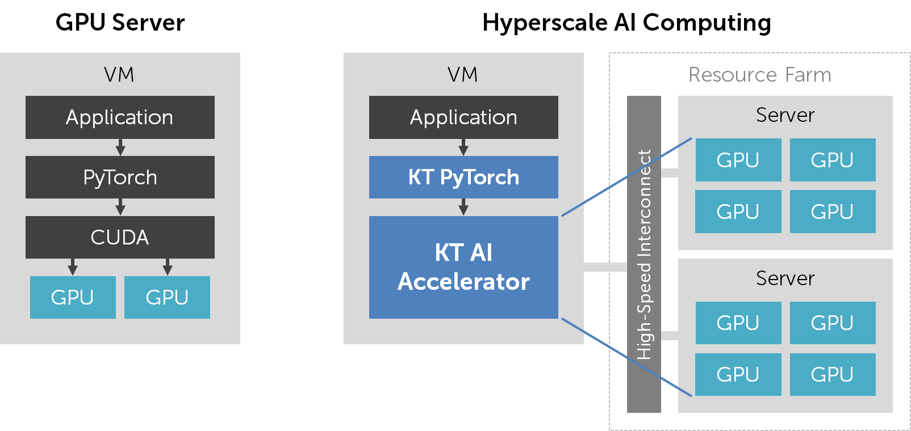

# 자주 묻는 질문

## 서비스 기본 개념

---

#### **Q. VM에서 lspci 혹은 nvidia-smi를 실행했는데 GPU가 인식이 되지 않습니다.**

**A.** Hyperscale AI Computing 서비스는 물리적인 GPU 자원을 바로 제공하지 않으며 따라서 GPU가 인식되지 않는 것이 정상입니다. 대신 VM에는 PyTorch에서 사용 가능한 논리적인 AI 가속기가 할당되어 있습니다. AI 가속기 정보는 터미널에서 moreh-smi 명령을 실행하여 확인할 수 있습니다. "KT AI Accelerator" 디바이스가 하나 표시되면 정상적으로 AI 가속기가 할당되어 있는 것입니다.

```shell
(pytorch) ubuntu@vm:~$ moreh-smi
+--------------------------------------------------------------------------------------------------------------+
|  Moreh-SMI 0.8.0                                               Client Version: 0.8.0  Server Version: 0.8.0  |
+--------------------------------------------------------------------------------------------------------------+
|  Device  |        Name         |            Token           |     Model    |  Memory Usage  |  Total Memory  |
+==============================================================================================================+
|       1  |  KT AI Accelerator  |  ZXhhbXBsZSB0b2tlbiBzdHI=  |  small.16gb  |  -             |  -             |
+--------------------------------------------------------------------------------------------------------------+

Processes:
+----------------------------------------------------------+
|  Device  |  Job ID  |  PID  |  Process  |  Memory Usage  |
+==========================================================+
+----------------------------------------------------------+
```

```shell
(pytorch) ubuntu@vm:~$ moreh-smi
+--------------------------------------------------------------------------------------------------------------+
|  Moreh-SMI 0.8.0                                               Client Version: 0.8.0  Server Version: 0.8.0  |
+--------------------------------------------------------------------------------------------------------------+
|  Device  |        Name         |            Token           |     Model    |  Memory Usage  |  Total Memory  |
+==============================================================================================================+
|       1  |  KT AI Accelerator  |  ZXhhbXBsZSB0b2tlbiBzdHI=  |  small.16gb  |  -             |  -             |
+--------------------------------------------------------------------------------------------------------------+

Processes:
+----------------------------------------------------------+
|  Device  |  Job ID  |  PID  |  Process  |  Memory Usage  |
+==========================================================+
+----------------------------------------------------------+
```

AI 가속기는 PyTorch에서 `cuda:0` 디바이스로 인식되며, 기존 CUDA 디바이스와 호환되는 API를 제공합니다. 따라서 물리적인 GPU가 없더라도 기존에 NVIDIA GPU용으로 작성된 PyTorch 프로그램을 그대로 실행할 수 있습니다.

---

#### **Q. Hyperscale AI Computing은 어떤 방식으로 GPU 자원을 사용하게 되나요?**

**A.** PyTorch와 함께 설치되는 Hyperscale AI Computing 지원 플러그인이 GPU 자원의 할당 및 사용을 위한 모든 작업을 자동으로 수행합니다.

먼저 PyTorch 프로그램이 실행되면 서버에 요청을 보내 resource farm에 위치하는 GPU 자원을 하나 이상 할당받습니다. 화면에 다음과 같은 메시지가 표시되면 GPU 자원에 연결이 완료된 것입니다.

```
[info] Requesting resources for KT AI Accelerator from the server...
[info] Initializing the worker daemon for KT AI Accelerator...
[info] [1/1] Connecting to resources on the server (192.168.00.00:00000)...
[info] Establishing links to the resources...
[info] KT AI Accelerator is ready to use.
```

이후 PyTorch 프로그램이 실행되면서 GPU 연산을 요청하면 이것을 원격에 위치한 GPU에 오프로딩(offloading)하게 됩니다. VM은 resource farm과 전용 네트워크로 연결되어 있으며 그 외의 물리적인 장치를 사용하지 않습니다.

AI 가속기의 사양이 높아지면 PyTorch 프로그램을 실행하기 위해 수~수십 개의 GPU를 동시에 사용할 수도 있습니다. 하지만 사용자는 이를 위해 PyTorch 프로그램을 DataParallel, DistributedDataParallel 등을 사용해 병렬화할 필요가 전혀 없습니다. AI 가속기에서는 단일 GPU를 위한 PyTorch 프로그램을 실행하면 됩니다. Hyperscale AI Computing 컴파일러가 자동으로 연산 작업을 병렬화하여 여러 GPU 자원에서 분산 처리합니다.

---

#### **Q. Hyperscale AI Computing 서비스는 일반 GPU 서버와 어떤 차이점이 있나요?**

**A.** Hyperscale AI Computing 서비스는 물리 GPU를 제공하는 대신 “KT AI Accelerator”라는 가상의 AI 가속기를 제공합니다. 기존 GPU 서버에서는 CUDA를 설치하고 CUDA 기반의 PyTorch를 설치하여 GPU를 사용하였습니다. 반면 Hyperscale AI Computing 서비스에서는 KT Cloud가 별도로 제공하는 PyTorch 버전을 사용해야 합니다. 여기에는 GPU 가상화 및 자동 병렬화를 위한 기능이 함께 포함되어 있습니다.



기존 GPU 서버와 Hyperscale AI Computing 서비스 간의 차이점을 정리하자면 다음과 같습니다.

---

#### **Q. Hyperscale AI Computing의 AI 가속기 모델은 어떤 기준으로 선택해야 하나요?**

**A.** 공식 지원 모델을 사용 중인 경우 해당 모델의 매뉴얼에 AI 가속기 모델 별 예상 학습 시간이 안내되어 있습니다. 이를 참고하여 AI 가속기 모델을 선택하십시오.

AI 가속기의 연산 성능과 메모리 용량은 같은 비율로 증가합니다. 즉 small.64gb 모델보다 medium.128gb 모델이 2배, 그리고 medium.128gb 모델보다 large.256gb 모델이 2배 높은 연산 성능과 메모리 용량을 가집니다. 물론 실제 프로그램 실행 시에 연산 속도가 정확히 2배씩 향상되지는 않으므로 이 점을 감안하시기 바랍니다. 프로그램의 연산량이 많지 않은 경우 AI 가속기 사양을 높이더라도 연산 속도가 개선되지 않거나 오히려 떨어질 수 있습니다.

Hyperscale AI Computing VM을 생성한 후에도 언제든지 필요하다면 AI 가속기 모델을 다른 것으로 변경할 수 있습니다. 따라서 정확히 어느 정도 사양이 필요한지 모르신다면 일단 서비스를 이용하시면서 조정을 해 나가시기를 권장드립니다.

---

#### **Q. 기존에 DataParallel 혹은 DistributedDataParallel로 병렬 처리하여 사용하던 코드가 있습니다. 이를 Hyperscale AI Computing 서비스에서 실행하려면 어떻게 해야 하나요?**

**A.** Hyperscale AI Computing 서비스에서는 GPU가 하나만 있다고 가정하고 PyTorch 프로그램을 작성/실행하시면 됩니다. 즉 기존 코드에서 애초에 DataParallel/DistributedDataParallel을 비활성화하는 옵션을 사용하시거나, 혹은 GPU 개수를 1로 설정하고 그냥 코드를 실행하시면 DataParallel/DistributedDataParallel 관련 함수들이 알아서 무시가 될 것입니다. 관련 작업에 어려움을 겪으신다면 기술 지원을 요청해 주시면 도와드리겠습니다.

유의하실 점은, 상당수의 모델 학습 코드에서 인자로 전체 GPU의 batch size 합이 아닌 각 GPU별 batch size를 입력으로 받는 경우가 있습니다. 예를 들어 GPU 4개를 사용할 때, batch size를 16으로 지정하면 16개의 데이터를 각 GPU가 나눠 가지는 것이 아니라 각 GPU마다 16개씩 총 64개의 데이터를 한 번에 학습하도록 동작하는 경우가 있습니다. 이 경우 일반 GPU 서버에서는 GPU 개수를 늘리더라도 batch size 값을 고정해야 scale up이 이루어졌습니다. 반면 Hyperscale AI Computing 서비스를 이용하실 때는 AI 가속기 사양을 높일 때마다 batch size 값도 같이 키워 주어야 scale up이 이루어집니다.

#### **Q. Docker를 사용하여 AI 가속기를 사용하고 싶습니다. 어떻게 해야 합니까?**

**A.** Hyperscale AI Computing 서비스는 AI 가속기를 사용 가능한 별도의 Docker 이미지를 제공하고 있습니다. VM에서 다음과 같이 실행하여 AI 가속기가 활성화된 컨테이너를 실행할 수 있습니다.

```
(pytorch) ubuntu@vm:~$ **sudo moreh-docker-run**
...
Login Succeeded
Unable to find image 'sys.deploy.kt-epc.moreh.io:5001/moreh:0.8.0' locally
0.8.0: Pulling from moreh
...
Digest: sha256:003b54de6395f468799db818e1c884a3dfd92f7ec296a40c082b123cc9298ac2
Status: Downloaded newer image for sys.deploy.kt-epc.moreh.io:5001/moreh:0.8.0
(moreh) root@vm:~#
```

컨테이너 안에서 AI 가속기 정보를 조회하고 PyTorch 프로그램을 실행시킬 수 있습니다.

```
(moreh) root@vm:~# **moreh-smi**
+--------------------------------------------------------------------------------------------------------------+
|  Moreh-SMI 0.8.0                                               Client Version: 0.8.0  Server Version: 0.8.0  |
+--------------------------------------------------------------------------------------------------------------+
|  Device  |        Name         |            Token           |     Model    |  Memory Usage  |  Total Memory  |
+==============================================================================================================+
|       1  |  KT AI Accelerator  |  ZXhhbXBsZSB0b2tlbiBzdHI=  |  small.16gb  |  -             |  -             |
+--------------------------------------------------------------------------------------------------------------+

Processes:
+----------------------------------------------------------+
|  Device  |  Job ID  |  PID  |  Process  |  Memory Usage  |
+==========================================================+
+----------------------------------------------------------+
(moreh) root@vm:~# **python pytorch-sample.py**
Downloading http://fashion-mnist.s3-website.eu-central-1.amazonaws.com/train-images-idx3-ubyte.gz to data/FashionMNIST/raw/train-images-idx3-ubyte.gz
26427392it [00:04, 5389702.34it/s]
Extracting data/FashionMNIST/raw/train-images-idx3-ubyte.gz to data/FashionMNIST/raw
Downloading http://fashion-mnist.s3-website.eu-central-1.amazonaws.com/train-labels-idx1-ubyte.gz to data/FashionMNIST/raw/train-labels-idx1-ubyte.gz
32768it [00:00, 36542.51it/s]
Extracting data/FashionMNIST/raw/train-labels-idx1-ubyte.gz to data/FashionMNIST/raw
Downloading http://fashion-mnist.s3-website.eu-central-1.amazonaws.com/t10k-images-idx3-ubyte.gz to data/FashionMNIST/raw/t10k-images-idx3-ubyte.gz
4423680it [00:08, 505491.87it/s]
Extracting data/FashionMNIST/raw/t10k-images-idx3-ubyte.gz to data/FashionMNIST/raw
Downloading http://fashion-mnist.s3-website.eu-central-1.amazonaws.com/t10k-labels-idx1-ubyte.gz to data/FashionMNIST/raw/t10k-labels-idx1-ubyte.gz
8192it [00:00, 13945.86it/s]
Extracting data/FashionMNIST/raw/t10k-labels-idx1-ubyte.gz to data/FashionMNIST/raw
Processing...
Done!
[info] Requesting resources for KT AI Accelerator from the server...
[info] Initializing the worker daemon for KT AI Accelerator...
[info] [1/1] Connecting to resources on the server (192.168.00.00:00000)...
[info] Establishing links to the resources...
[info] KT AI Accelerator is ready to use.
Epoch 1
loss: 2.298501  [    0/60000]
loss: 2.287861  [ 6400/60000]
loss: 2.270298  [12800/60000]
^C
```

컨테이너 안에서 인식되는 AI 가속기는 VM에 할당된 AI 가속기와 동일한 것입니다. VM에서 가속기 모델을 변경하면 컨테이너 안에서도 적용되며 그 반대도 마찬가지입니다. 또한 VM에서 AI 가속기를 사용하는 동안은 컨테이너 안에서는 AI 가속기를 사용할 수 없으며 이것 역시 반대도 마찬가지입니다. 예를 들어 VM에서 AI 가속기를 사용하는 train.py 프로그램이 실행 중인 동안 컨테이너에서 AI 가속기를 사용하는 다른 프로그램을 실행할 경우, 아래와 같은 메시지를 출력하고 VM에서 train.py 프로그램이 끝날 때까지 대기하게 됩니다.

```
(moreh) root@vm:~# **python pytorch-sample.py**
...
[info] Requesting resources for KT AI Accelerator from the server...
[warning] KT AI Accelerator is already in use by another process:
[warning]   (pid: 10000) python train.py
[warning] Two or more processes cannot use KT AI Accelerator at the same time. The program will resume automatically after the process 10000 terminates...
```

NVIDIA GPU 사용 시 NVIDIA의 base image를 바탕으로 다른 이미지를 만들 수 있듯이, Hyperscale AI Computing에서도 위의 이미지를 바탕으로 다른 이미지를 만들 수 있습니다. Hyperscale AI Computing 서비스에서 실행되는 Docker 이미지를 만드는 데 어려움을 겪으신다면 기술 지원을 통해 문의하십시오.

### AI 가속기 관련 문제 해결

---

#### **Q. KT Cloud에서 Hyperscale AI Computing 서비스용으로 별도 제공하는 PyTorch는 어떻게 설치해야 하나요?**

**A.** VM을 처음 만들면 Hyperscale AI Computing 서비스용 PyTorch가 미리 설치되어 있습니다. 터미널에서 `conda list torch`를 실행하였을 때 PyTorch 버전이 `1.7.1+cu110.moreh00.0.0`와 같은 형식으로 표시될 것입니다.

```
(pytorch) ubuntu@vm:~$ **conda list torch**
# packages in environment at /home/ubuntu/.conda/envs/pytorch:
#
# Name                    Version                   Build  Channel
torch                     1.7.1+cu110.moreh22.8.0          pypi_0    pypi
torchaudio                0.7.2                    pypi_0    pypi
torchvision               0.8.2                    pypi_0    pypi
```

PyTorch를 다른 버전으로 재설치할 경우 AI 가속기를 정상적으로 사용할 수 없으므로 유의하시기 바랍니다. 특히 `requirements.txt` 파일에 적힌 패키지를 일괄 설치하는 과정에서 이런 일이 발생할 수 있습니다. 터미널에서 `update-moreh --force`를 실행하면 Hyperscale AI Computing 서비스용 PyTorch를 다시 복구할 수 있습니다.

---

#### **Q. VM 로그인 시 기본적으로 “pytorch”라는 Anaconda 가상 환경이 활성화됩니다. 다른 가상 환경을 만들 수는 없습니까?**

A. “pytorch” 가상 환경에는 이미 Hyperscale AI Computing 서비스를 위한 각종 소프트웨어 설정이 완료되어 있으므로 가급적 해당 환경에서 시스템을 사용해 주시기를 권장 드립니다.

만약 별도의 가상 환경을 생성하기를 희망하실 경우, Python 3.8 버전을 사용하도록 가상 환경을 만들어 주시고 update-moreh --force 명령을 사용하여 해당 가상 환경 내에서 최신 버전의 Hyperscale AI Computing 서비스용 PyTorch를 재설치하시기 바랍니다.

```
(base) ubuntu@vm:~$ **conda create -n your_new_env python=3.8**
(base) ubuntu@vm:~$ **conda activate your_new_env**
(your_new_env) ubuntu@vm:~$ **update-moreh --force**
```

여러 개의 가상 환경에서 동시에 AI 가속기를 사용하시려는 경우 반드시 모든 가상 환경에서 동일 버전의 PyTorch가 설치되어 있어야 합니다. 각 가상 환경에서 차례로 update-moreh 명령을 실행하여 최신 버전의 소프트웨어를 설치할 수 있습니다.

---

#### **Q. PyTorch 프로그램을 실행하였는데 "Two or more processes cannot use KT AI Accelerator at the same time." 메시지가 출력되고 프로그램이 멈춰 있습니다.**

**A.** Hyperscale AI Computing 서비스는 하나의 VM에서 AI 가속기를 사용하는 프로그램을 동시에 두 개 이상 실행할 수 없도록 되어 있습니다. 따라서 예를 들어 AI 가속기를 사용하는 train.py 프로그램이 실행 중인 동안 마찬가지로 AI 가속기를 사용하는 inference.py 프로그램을 실행할 경우, 나중에 실행한 프로그램은 메시지를 출력하고 앞에 실행한 프로그램이 끝날 때까지 대기하게 됩니다.

```
(pytorch) ubuntu@vm:~$ **python inference.py**
...
[info] Requesting resources for KT AI Accelerator from the server...
[warning] KT AI Accelerator is already in use by another process:
[warning]   (pid: 10000) python train.py
[warning] Two or more processes cannot use KT AI Accelerator at the same time. The program will resume automatically after the process 10000 terminates...
```

만약 AI 가속기를 사용하는 다른 프로그램이 없는데도 위와 같은 메시지가 표시된다면 다음 질문을 참고하십시오.

---

#### **Q. VM에서 실행 중인 다른 PyTorch 프로그램이 없음에도 불구하고 계속 "Two or more processes cannot use KT AI Accelerator at the same time." 메시지가 출력됩니다.**

**A.** 일부 PyTorch 프로그램은 학습/추론 과정에서 데이터를 빠르게 불러 오기 위해 별도의 DataLoader 프로세스를 실행합니다. 이 경우 PyTorch 프로그램이 비정상 종료했을 때(예를 들어 Ctrl+C로 강제 종료했을 때) 주 프로세스는 없어지더라도 DataLoader 프로세스는 없어지지 않고 AI 가속기와 CPU 코어, 메인 메모리를 점유하면서 남아 있는 경우가 있습니다.

현재 VM에 실행 중인 Python 프로세스가 존재하는지 ps aux | grep python 명령으로 확인할 수 있습니다. 또한 실행 중인 모든 Python 프로세스를 pkill python 명령으로 제거할 수 있습니다.

```
(pytorch) ubuntu@vm:~$ **ps aux | grep python**
root      1700  0.0  0.0 169104 17136 ?        Ssl  Dec03   0:00 /usr/bin/python3 /usr/bin/networkd-dispatcher --run-startup-triggers
root      1900  0.0  0.0 185956 20112 ?        Ssl  Dec03   0:00 /usr/bin/python3 /usr/share/unattended-upgrades/unattended-upgrade-shutdown --wait-for-signal
ubuntu    9900 84.1  0.1 3688828 508348 pts/1  Sl   08:50   0:18 python train.py
ubuntu    9901 79.5  0.1 3671492 491104 pts/1  Sl   08:50   0:17 python train.py
ubuntu    9902 65.4  0.1 3670744 490580 pts/1  Sl   08:50   0:14 python train.py
ubuntu    9903 67.5  0.1 3671280 490440 pts/1  Sl   08:50   0:14 python train.py
ubuntu   10000  0.0  0.0  14864  1116 pts/2    S+   08:51   0:00 grep --color=auto python
(pytorch) ubuntu@vm:~$ **pkill python**
(pytorch) ubuntu@vm:~$ **ps aux | grep python**
root      1700  0.0  0.0 169104 17136 ?        Ssl  Dec03   0:00 /usr/bin/python3 /usr/bin/networkd-dispatcher --run-startup-triggers
root      1900  0.0  0.0 185956 20112 ?        Ssl  Dec03   0:00 /usr/bin/python3 /usr/share/unattended-upgrades/unattended-upgrade-shutdown --wait-for-signal
ubuntu   10001  0.0  0.0  14864  1116 pts/2    S+   08:51   0:00 grep --color=auto python
```

만약 실행 중인 Python 프로세스가 전혀 존재하지 않음에도 불구하고 위와 같은 메시지가 표시된다면 moreh-smi --reset 명령으로 GPU 자원을 강제로 할당 해제할 수 있습니다.

```
(pytorch) ubuntu@vm:~$ **moreh-smi --reset**
Device release success.
```

이 두 가지 방법으로도 문제가 해결되지 않으면 기술 지원을 받으시기 바랍니다.

---

#### **Q. PyTorch 프로그램을 실행하였는데 "Not enough resources are currently available for KT AI Accelerator." 메시지가 출력되고 프로그램이 멈춰 있습니다.**

**A.** Hyperscale AI Computing 시스템에 동시에 너무 많은 자원 할당 요청이 들어 올 경우 일시적으로 GPU 자원의 신규 할당이 불가능할 수 있습니다. 이 경우 프로그램이 메시지를 출력하고 GPU 자원이 할당될 때까지 대기할 수 있습니다. 이 경우 가만히 있으면 GPU 자원을 할당 받은 이후 자동으로 실행이 재개됩니다.

```
(pytorch) ubuntu@vm:~$ **python train.py**
...
[info] Requesting resources for KT AI Accelerator from the server...
[warning] Not enough resources are currently available for KT AI Accelerator. All resources in the system are being used by other users. The program will resume automatically when resources become available...
```

---

#### **Q. PyTorch 프로그램을 실행하였는데 "The current version of Moreh AI Framework is outdated and no longer supported in the system" 메시지가 출력되고 프로그램이 강제 종료됩니다.**

**A.** Hyperscale AI Computing 서비스는 지속적으로 소프트웨어 업데이트가 이루어지고 있습니다. 현재 VM에 설치된 소프트웨어가 구 버전인 경우 실제 GPU 쪽 소프트웨어와 호환성이 맞지 않아 프로그램 실행이 불가능할 수 있습니다. 이 경우 터미널에서 update-moreh 명령을 실행하여 소프트웨어를 자동으로 업데이트할 수 있습니다.

```
(pytorch) ubuntu@vm:~$ **update-moreh**
Currently installed: 0.8.0
Possible upgrading version: 0.8.1

Do you want to upgrade? (y/n, default:n)
**y**
...
Finished processing dependencies for moreh-driver==0.8.1

installed : /usr/bin/moreh-smi
installed : /usr/bin/moreh-switch-model
installed : /usr/bin/update-moreh
installed : /usr/lib/libcommunication.so
installed : /usr/lib/libmodnnruntime.so
```

---

## Troubleshooting

#### **Q. PyTorch 프로그램을 실행하였는데 CUDA error가 출력되면서 프로그램이 강제 종료됩니다.**

**A.** 우선 터미널에서 `conda list pytorch`를 실행하여 PyTorch가 정상 설치되었는지 확인하십시오. PyTorch 버전이 `1.7.1+cu110.moreh00.0.0`와 같은 형식으로 표시되면 정상 설치되어 있는 것입니다.

```
(pytorch) ubuntu@vm:~$ **conda list torch**
# packages in environment at /home/ubuntu/.conda/envs/pytorch:
#
# Name                    Version                   Build  Channel
torch                     1.7.1+cu110.moreh22.8.0          pypi_0    pypi
torchaudio                0.7.2                    pypi_0    pypi
torchvision               0.8.2                    pypi_0    pypi
```

그리고 다음과 같이 실행하여 PyTorch 버전 및 Hyperscale AI Computing 플러그인 버전 정보를 확인하십시오. import torch 혹은 torch.version.moreh 결과 에러가 발생하면 PyTorch 혹은 플러그인에 문제가 있는 것입니다.

```
(pytorch) ubuntu@vm:~$ **python**
Python 3.8.12 (default, Oct 12 2021, 13:49:34)
[GCC 7.5.0] :: Anaconda, Inc. on linux
Type "help", "copyright", "credits" or "license" for more information.
>>> **import torch**
>>> **torch.__version__**
'1.7.1'
>>> **torch.version.moreh**
'22.8.0'
>>> **quit()**
(pytorch) ubuntu@vm:~$
```

위 두 단계 중 하나에서 실패한 경우 다음과 같이 실행하여 PyTorch를 재설치해 보십시오.

```
(pytorch) ubuntu@vm:~$ **update-moreh --force**
```

애플리케이션에 NVIDIA GPU 의존적인 기능이 포함되어 있는 경우 Hyperscale AI Computing 서비스용 PyTorch가 정상 설치되었더라도 CUDA error가 발생할 수 있습니다. 이 경우 별도로 기술 지원을 받으시기 바랍니다.

---

#### **Q. PyTorch 프로그램을 실행하거나 update-moreh 명령을 실행할 때 "ImportError: numpy.core.multiarray failed to import" 에러가 발생합니다.**

**A.** 시스템에 너무 낮은 버전(1.16 미만)의 NumPy 라이브러리가 설치되어 문제가 발생할 수 있습니다. 다음과 같이 실행하여 현재 설치된 NumPy 버전을 확인하십시오.

```
(pytorch) ubuntu@vm:~$ **conda list numpy**
# packages in environment at /home/ubuntu/.conda/envs/pytorch:
#
# Name                    Version                   Build  Channel
numpy                     1.15.2                   pypi_0    pypi
```

다음과 같이 실행하여 NumPy 버전을 업데이트할 수 있습니다.

```
(pytorch) ubuntu@vm:~$ **conda install numpy -c conda-forge**
```

---

#### **Q. PyTorch 프로그램을 실행하거나 moreh-smi 혹은 moreh-switch-model 명령을 실행하였는데 "SDA token is not given." 에러가 발생합니다.**

**A.** Hyperscale AI Computing 서비스는 AI 가속기를 식별하기 위해 /etc/moreh/token 파일의 내용을 읽어 옵니다. 다음과 같이 실행하여 해당 파일이 접근 가능한지 확인하십시오.

```
(pytorch) ubuntu@vm:~$ cat /etc/moreh/token
ZXhhbXBsZSB0b2tlbiBzdHI=
```

만약 위와 같이 실행하였을 때 문제가 발생한다면 기술 지원을 받으시기 바랍니다.

---

#### **Q. moreh-switch-model 명령으로 AI 가속기 모델을 바꾸려고 하니 "The model cannot be switched while the KT AI Accelerator is in use." 에러가 발생합니다.**

**A.** AI 가속기에서 프로그램이 실행 중인 동안에는 모델을 바꿀 수 없습니다. 만약 AI 가속기를 사용하는 다른 프로그램이 없는데도 위와 같은 메시지가 표시된다면 다음 질문을 참고하십시오.

- VM에서 실행 중인 다른 PyTorch 프로그램이 없음에도 불구하고 계속 "Two or more processes cannot use KT AI Accelerator at the same time." 메시지가 출력됩니다.

---

#### **Q. PyTorch 프로그램을 실행하였는데 "KT AI Accelerator memory not enough." 메시지가 출력되고 프로그램이 강제 종료됩니다.**

**A.** AI 가속기의 메모리 용량이 부족하여 해당 프로그램의 실행이 실패하였음을 의미합니다. 공식 지원 모델을 사용 중인 경우 해당 모델의 매뉴얼에 안내된 권장 batch size를 사용하였는지 확인해 보십시오. 혹은 moreh-switch-model 명령을 사용해 AI 가속기 모델을 더 고사양으로 변경한 다음 프로그램을 실행하여 보십시오.

---

#### **Q. PyTorch 프로그램을 실행하였는데 "Failed to initialize the worker daemon for KT AI Accelerator." 메시지가 출력되고 프로그램이 강제 종료됩니다.**

**A.** VM이 할당받은 GPU 자원을 초기화하는 과정에서 문제가 생겼음을 의미합니다. 프로그램을 다시 한 번 실행해 보시고, 같은 증상이 여러 번 반복되면 기술 지원을 받으시기 바랍니다. 기술 지원 시 프로그램을 실행한 시간이 언제인지를 전달해 주시면 더 빨리 도움을 드릴 수 있습니다.

---

#### **Q. PyTorch 프로그램을 실행하였는데 "Connecting to resources on the server" 메시지 직후에 "The connection to the server has been lost." 메시지가 출력되고 프로그램이 강제 종료됩니다.**

```
[info] Requesting resources for KT AI Accelerator from the server...
[info] Initializing the worker daemon for KT AI Accelerator...
[info] [1/1] Connecting to resources on the server (192.168.00.00:00000)...
[info] Establishing links to the resources...
[error] The connection to the server has been lost. Please contact technical support if the problem persists.
```

**A.** VM이 할당받은 GPU 자원에 접속하는 과정에서 문제가 생겼음을 의미합니다. 프로그램을 다시 한 번 실행해 보시고, 같은 증상이 여러 번 반복되면 기술 지원을 받으시기 바랍니다. 기술 지원 시 프로그램을 실행한 시간이 언제인지를 전달해 주시면 더 빨리 도움을 드릴 수 있습니다.

서버 접속 장애로 인해 프로그램이 강제 종료된 경우 해당 실행 건에 대해서는 요금이 부과되지 않습니다.

---

#### **Q. PyTorch 프로그램을 실행하였는데 GPU 연산이 한참 실행되던 중에 갑자기 "The connection to the server has been lost." 메시지가 출력되고 프로그램이 강제 종료됩니다.**

**A.** VM이 할당받은 GPU 자원과 통신하는 과정에서 문제가 생겼음을 의미합니다. 프로그램을 다시 한 번 실행해 보시고, 같은 증상이 여러 번 반복되면 기술 지원을 받으시기 바랍니다. 기술 지원 시 프로그램을 실행한 시간이 언제인지를 전달해 주시면 더 빨리 도움을 드릴 수 있습니다.

서버 통신 장애로 인해 프로그램이 강제 종료된 경우 해당 실행 건에 대해서는 요금이 부과되지 않습니다.

---

#### **Q. PyTorch 프로그램을 실행하였는데 "An internal error occurred in the KT AI Accelerator" 메시지가 출력되고 프로그램이 강제 종료됩니다.**

**A.** GPU 자원 내부에서 연산 에러가 생겼음을 의미합니다. 메시지 아래에 출력되는 "Error message:" 란의 내용을 첨부하여 기술 지원을 받으시기 바랍니다.

GPU 연산 에러로 인해 프로그램이 강제 종료된 경우 해당 실행 건에 대해서는 요금이 부과되지 않습니다.