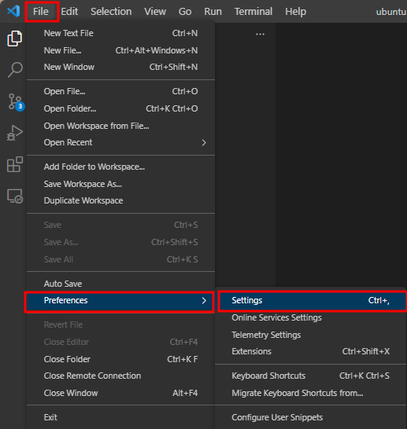
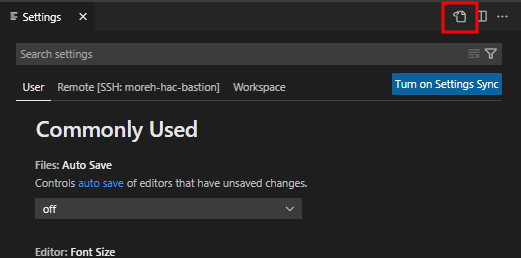
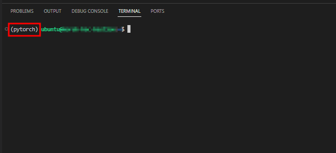

# Visual Studio Code Terminal Setting

## VSCode Terminal에서 SSH 이용시 Conda 가상환경 인식문제 해결

VSCode Terminal 에서 HAC VM을 SSH로 사용할 경우, VSCode 는 디폴트로 bash_profile 등의 환경변수를 읽지 못하기 때문에, HAC VM에 기본으로 설정된 Conda 가상환경 및 각종 필요한 환경변수들이 읽히지 않을 수 있습니다. 이러한 경우 VSCode 에 간단한 설정하면 HAC VM의 환경변수 등을 읽도록 할 수 있습니다.

### 설정방법

VSCode 의 메뉴에서 Settings 로 진입합니다.  File > Preferences > Settings (윈도우 단축키 Ctrl+,)



상단의 ‘Open Settings (JSON)’ 아이콘을 클릭합니다.



아래의 코드를 화면과 같이 설정파일에 추가하고 `settings.json` 를 저장합니다.

```jsx
"terminal.integrated.defaultProfile.linux": "bash",
    "terminal.integrated.profiles.linux": {
    "bash": {
        "path": "/bin/bash",
        "icon": "terminal-bash",
        "args": [ "-l" ]
    },
    }
```


VSCode 의 Terminal 에서 HAC VM에 SSH로 접속하여 정상적으로 Conda 가상환경을 표시하는지 확인합니다.

