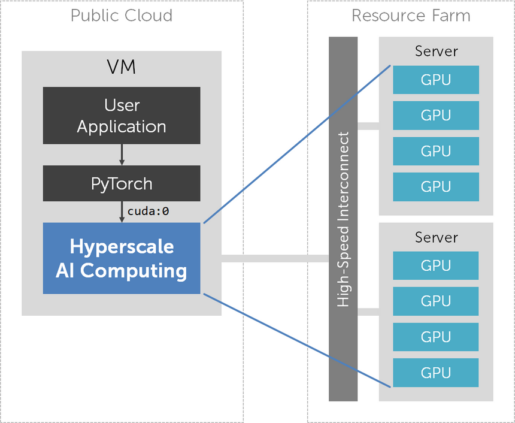

# Hyperscale AI Computing 상품 개요

# 목적/용도

KT Hyperscale AI Computing 서비스는 인공지능 학습/추론을 위한 유연하고 확장성 높은 AI 가속기(accelerator)를 제공하는 서비스입니다. AI 가속기 위에서 PyTorch 기반 딥 러닝 프로그램을 고성능으로 실행할 수 있습니다.

Hyperscale AI Computing 서비스는 가속기의 연산 성능과 메모리 용량을 가변적으로 조정할 수 있으며, 특히 기존 GPU Server로는 불가능했던 수준의 고사양을 선택할 수 있어 AI 모델 대형화에 탄력적으로 대응 가능합니다. 또한 AI 가속기는 실제 연산이 실행 중인 동안에만 동적으로 자원을 할당 받기 때문에 기존 pass-through 방식 GPU Server에 비해 합리적인 비용으로 서비스를 이용할 수 있습니다.

일반적으로 널리 사용되는 여러 가지 인공신경망 모델을 Hyperscale AI Computing 서비스 상에서 실행할 수 있도록, 공식 지원 모델에 대한 학습/추론 스크립트와 샘플 데이터가 함께 제공됩니다.

# 구조/원리

KT Hyperscale AI Computing 서비스가 제공하는 AI 가속기는 PyTorch에서 `cuda:0` 디바이스로 인식되며, 기존 CUDA 디바이스와 호환되는 API를 제공합니다. 따라서 기존에 NVIDIA GPU를 사용하던 방식 그대로 PyTorch 프로그램을 작성, 실행할 수 있습니다.

AI 가속기에서 프로그램을 실행하면 별도의 resource farm에 위치하는 GPU 자원들이 VM에 동적으로 할당됩니다. 또한 프로그램이 종료되면 GPU 자원이 자동으로 할당 해제됩니다. 사용자가 실제로 GPU 자원을 실제로 점유한 양과 시간이 별도로 기록되어, 이에 비례한 요금이 부과됩니다.

기존 GPU Server에서는 연산 성능을 높이려면 GPU 개수를 늘리고 이에 맞게 DataParallel, DistributedDataParallel 등을 사용하여 프로그램을 수정해야 했습니다. 반면 Hyperscale AI Computing에서는 단순히 AI 가속기를 더 고사양으로 변경한 다음, 단일 GPU를 위한 병렬화되지 않은 PyTorch 프로그램을 실행하면 됩니다. Hyperscale AI Computing 컴파일러가 자동으로 연산 작업을 병렬화하여 여러 GPU 자원에서 분산 처리하기 때문입니다. AI 가속기는 사양에 따라 수~수십 개의 GPU를 할당받아 사용할 것이나, 사용자는 GPU의 개수나 물리적 위치를 전혀 신경 쓰지 않아도 됩니다.

GPU 자원의 할당 및 사용은 애플리케이션 수준의 연산 오프로딩 기술로 구현되어 있어 기존 GPU 가상화 기술에 비해 뛰어난 성능을 제공합니다.

KT Hyperscale AI Computing 서비스는 KT와 국내 AI 인프라 소프트웨어 스타트업인 모레의 협업으로 제공되고 있습니다.

# 유의사항/제약사항

- Hyperscale AI Computing 서버는 현재 DX-M1 존에서만 생성이 가능합니다.
- PyTorch API를 사용하지 않고 CUDA를 직접 사용하거나 별도의 CUDA 기반 third-party library를 사용하는 경우 Hyperscale AI Computing 서비스에서 실행이 불가능합니다. 이 경우 일반 GPU Server를 사용하여 주십시오.
- Hyperscale AI Computing은 현재 베타 서비스 중으로 일부 PyTorch API의 경우 부분적인 호환성 이슈가 있을 수 있습니다. 이 경우 기술 지원을 통해 해결 가능합니다.