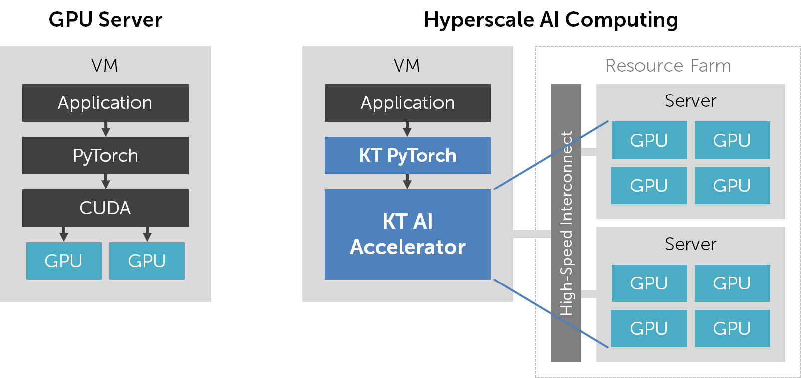

# Hyperscale AI Computing 상품 개요

## 목적/용도

KT Hyperscale AI Computing 서비스는 인공지능 학습/추론을 위한 유연하고 확장성 높은 AI 가속기(accelerator)를 제공하는 서비스입니다. AI 가속기 위에서 PyTorch 기반 딥 러닝 프로그램을 고성능으로 실행할 수 있습니다.

Hyperscale AI Computing 서비스는 가속기의 연산 성능과 메모리 용량을 가변적으로 조정할 수 있으며, 특히 기존 GPU Server로는 불가능했던 수준의 고사양을 선택할 수 있어 AI 모델 대형화에 탄력적으로 대응 가능합니다. 또한 AI 가속기는 실제 연산이 실행 중인 동안에만 동적으로 자원을 할당 받기 때문에 기존 pass-through 방식 GPU Server에 비해 합리적인 비용으로 서비스를 이용할 수 있습니다.

일반적으로 널리 사용되는 여러 가지 인공신경망 모델을 Hyperscale AI Computing 서비스 상에서 실행할 수 있도록, 공식 지원 모델에 대한 학습/추론 스크립트와 샘플 데이터가 함께 제공됩니다.

## 구조/원리

KT Hyperscale AI Computing 서비스가 제공하는 AI 가속기는 PyTorch에서 `cuda:0` 디바이스로 인식되며, 기존 CUDA 디바이스와 호환되는 API를 제공합니다. 따라서 기존에 NVIDIA GPU를 사용하던 방식 그대로 PyTorch 프로그램을 작성, 실행할 수 있습니다.

AI 가속기에서 프로그램을 실행하면 별도의 resource farm에 위치하는 GPU 자원들이 VM에 동적으로 할당됩니다. 또한 프로그램이 종료되면 GPU 자원이 자동으로 할당 해제됩니다. 사용자가 실제로 GPU 자원을 실제로 점유한 양과 시간이 별도로 기록되어, 이에 비례한 요금이 부과됩니다.

기존 GPU Server에서는 연산 성능을 높이려면 GPU 개수를 늘리고 이에 맞게 DataParallel, DistributedDataParallel 등을 사용하여 프로그램을 수정해야 했습니다. 반면 Hyperscale AI Computing에서는 단순히 AI 가속기를 더 고사양으로 변경한 다음, 단일 GPU를 위한 병렬화되지 않은 PyTorch 프로그램을 실행하면 됩니다. Hyperscale AI Computing 컴파일러가 자동으로 연산 작업을 병렬화하여 여러 GPU 자원에서 분산 처리하기 때문입니다. AI 가속기는 사양에 따라 수~수십 개의 GPU를 할당받아 사용할 것이나, 사용자는 GPU의 개수나 물리적 위치를 전혀 신경 쓰지 않아도 됩니다.

GPU 자원의 할당 및 사용은 애플리케이션 수준의 연산 오프로딩 기술로 구현되어 있어 기존 GPU 가상화 기술에 비해 뛰어난 성능을 제공합니다.


KT Hyperscale AI Computing 서비스는 KT와 국내 AI 인프라 소프트웨어 스타트업인 모레의 협업으로 제공되고 있습니다.

## 일반 GPU 서버와의 차이점

Hyperscale AI Computing 서비스는 인공지능 학습/추론을 위한 가상의 AI 가속기(accelerator) 기반으로 제공되는 서비스입니다. 기존 GPU 서버와의 차이점을 이해하면 Hyperscale AI Computing 서비스를 더욱 잘 활용하실 수 있습니다.

|항목|GPU 서버|Hyperscale AI Computing|
|------|---|---|
|제공되는 것|물리 GPU 1~8개|가상 GPU 1개<br>(가상 GPU사양에 따라 물리 GPU 수~수백개에 해당하는 성능을 얻을 수 있음|
|GPU를 사용하기 위해 필요한 소프트웨어|CUDA + Pytorch|KT Cloud에서 별도 제공하는 Pytorch<br>(VM에 미리 설치되어 있음)|
|Pytorch 프로그램 지원|O|X|
|CUDA를 직접 사용하는 third-party 라이브러리 및 프로그램 지원|O|X|
|과금 방식|VM 전체 이용 시간에 비례하여 GPU 요금 지불|실제 GPU를 사용하는 시간에 비례하여 GPU 요금 지불|
|프로그래밍 방식|물리 GPU 2개 이상을 사용할 경우 Pytorch/Tensorflow 상에서 별도의 병렬 처리 필요|병렬 처리 불필요<br>(단일 GPU처럼 사용)|
|Docker 사용 방법|NVIDIA의 base image 기반으로 컨테이터 작성/실행|Hyperscale AI Computing 서비스용 base image기반으로 컨테이너 작성/실행|

# 시스템 및 소프트웨어 구성

Hyperscale AI Computing 서비스는 물리 GPU를 제공하는 대신 “KT AI Accelerator”라는 가상의 AI 가속기를 제공합니다. 이 가속기는 PyTorch에서 `cuda:0` 디바이스로 인식되며, 기존에 물리 GPU를 사용하던 방식 그대로 PyTorch 프로그램을 작성, 실행할 수 있습니다. VM에서 `moreh-smi` 명령을 실행하여 현재 시스템의 AI 가속기 정보를 확인할 수 있습니다.

```
(pytorch) ubuntu@vm:~$ **moreh-smi**
+--------------------------------------------------------------------------------------------------------------+
|  Moreh-SMI 22.8.0                                            Client Version: 22.8.0  Server Version: 22.8.0  |
+--------------------------------------------------------------------------------------------------------------+
|  Device  |        Name         |            Token           |     Model    |  Memory Usage  |  Total Memory  |
+==============================================================================================================+
|       1  |  KT AI Accelerator  |  ZXhhbXBsZSB0b2tlbiBzdHI=  |  Small.64GB  |  -             |  -             |
+--------------------------------------------------------------------------------------------------------------+

Processes:
+----------------------------------------------------------+
|  Device  |  Job ID  |  PID  |  Process  |  Memory Usage  |
+==========================================================+
+----------------------------------------------------------+
```

기존 GPU 서버에서는 CUDA를 설치하고 CUDA 기반의 PyTorch를 설치하여 GPU를 사용하였습니다. 반면 Hyperscale AI Computing 서비스에서는 **KT Cloud가 별도로 제공하는 PyTorch 버전을 사용**합니다. 여기에는 GPU 가상화 및 자동 병렬화를 위한 기능이 포함되어 있습니다.



VM을 처음 만들면 Hyperscale AI Computing 서비스용 PyTorch가 미리 설치되어 있습니다. 터미널에서 `conda list torch`를 실행하였을 때 PyTorch 버전이 `1.7.1+cu110.moreh00.0.0`와 같은 형식으로 표시될 것입니다.

```
(pytorch) ubuntu@vm:~$ conda list torch
# packages in environment at /home/ubuntu/.conda/envs/pytorch:
#
# Name                    Version                   Build  Channel
torch                     1.7.1+cu110.moreh22.8.0          pypi_0    pypi
torchaudio                0.7.2                    pypi_0    pypi
torchvision               0.8.2                    pypi_0    pypi
```

PyTorch를 다른 버전으로 재설치할 경우 AI 가속기를 정상적으로 사용할 수 없으므로 유의하시기 바랍니다. 특히 `requirements.txt` 파일에 적힌 패키지를 일괄 설치하는 과정에서 이런 일이 발생할 수 있습니다. 터미널에서 `update-moreh --force`를 실행하면 Hyperscale AI Computing 서비스용 PyTorch를 다시 복구할 수 있습니다.

## 유의사항/제약사항

- Hyperscale AI Computing 서버는 현재 DX-M1 존에서만 생성이 가능합니다.
- PyTorch API를 사용하지 않고 CUDA를 직접 사용하거나 별도의 CUDA 기반 third-party library를 사용하는 경우 Hyperscale AI Computing 서비스에서 실행이 불가능합니다. 이 경우 일반 GPU Server를 사용하여 주십시오.
- Hyperscale AI Computing은 현재 베타 서비스 중으로 일부 PyTorch API의 경우 부분적인 호환성 이슈가 있을 수 있습니다. 이 경우 기술 지원을 통해 해결 가능합니다.