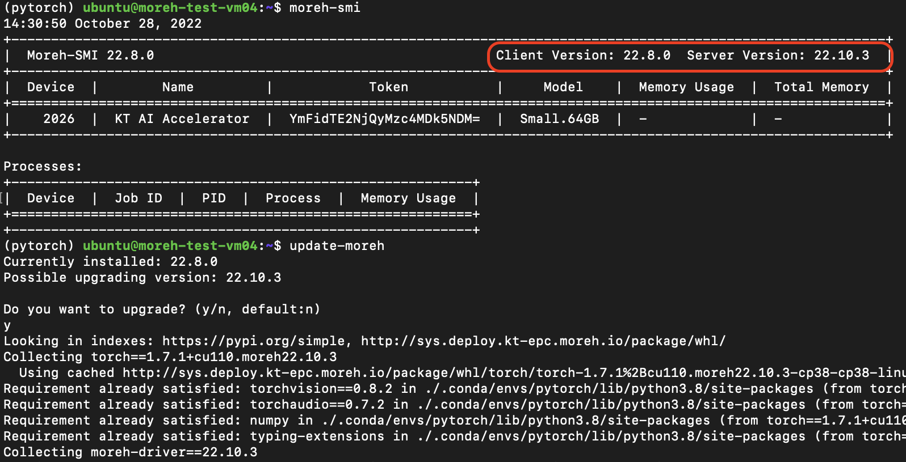

# Moreh 솔루션 업데이트 하기

가속기를 업데이트하는 명령어입니다. 
```
update-moreh
```

기본적으로 해당 명령어 실행시 현재까지 배포된 버전중 최신버전으로 업데이트를 진행합니다.

**Supported Arguments**

```
--target
```
Moreh AI Framework를 특정 버전으로 다운(업)그레이드를 할수있는 옵션입니다. `--target` 옵션뒤에는 특정 버전을 아래와 같이 기입 해주시면 됩니다.

```bash
update-moreh --target 22.7.2
```

현재 Moreh 솔루션이 정상적으로 동작하지 않아 동일한 버전으로 다시 Moreh 솔루션을 설치하고 싶은 경우나, 원하는 타켓 버전으로 업(다운)그레이드가 정상적으로 되지 않을 경우 `--force` 옵션을 통해 강제로 Moreh 솔루션의 업데이트를 진행할 수 있습니다.

```jsx
# 22.10.2 버전을 강제 설치
update-moreh --target 22.10.2 --force

# 최신버전으로 재설치
update-moreh --force
```

Client Version과 Server Version이 달라도 update-moreh를 진행해도 Moreh 솔루션은 무리없이 변경된 버전들에서 RM 및 Pytorch 가 무리 없이 정상적으로 동작합니다. 

- Moreh 솔루션 버전 업(다운)그레이드 해도 server 버전에는 영향을 미치지 않으니 그대로 진행하시면 됩니다.
    

   